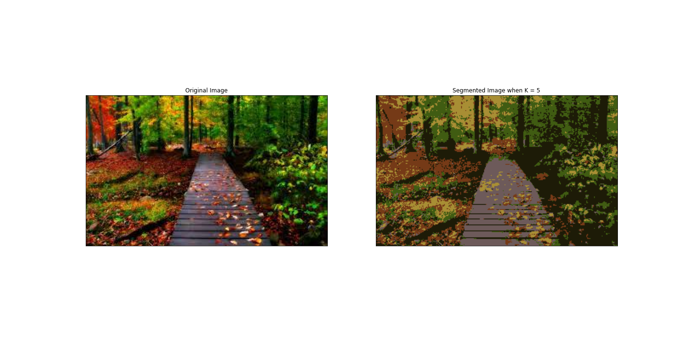
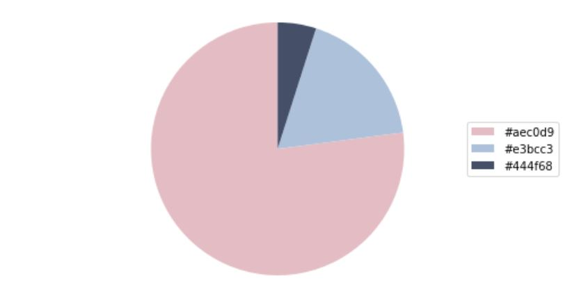
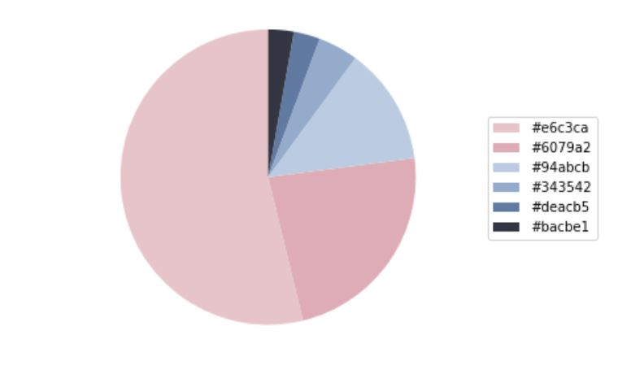

# Kmeans clustering

## Image compression with K-means

By using 3 ways the image was comperessed: Kmeans from scratch was described here, using cv2.kmeans library and the third one is by using Slearn library.

In a straightforward 24-bit color representation of an image, each pixel is represented as three 8-bit unsigned integers (ranging from 0 to 255) that specify the red, green and blue intensity values. This encoding is often referred to as the RGB encoding. Our image contains thousands of colors, and in this part of the exercise, you will reduce the number of colors to 5 colors.

By making this reduction, it is possible to represent (compress) the photo in an efficient way. Specifically, you only need to store the RGB values of the 16 selected colors, and for each pixel in the image you now need to only store the index of the color at that location (where only 4 bits are necessary to represent 5 possibilities).

By using the K-means algorithm to select the 5 colors that will be used to represent the compressed image. Concretely, every pixel in the original image as a data example and use the K-means algorithm to find the 5 colors that best group (cluster) the pixels in the 3-dimensional RGB space. Once the cluster centroids on the image were computed, then use the 5 colors to replace the pixels in the original image.

- - -

## Image compression with K-means

After resizing and clustering by Kmeans the color pallet of image wase made and it shows which color is in photos based on color hex.

### If k=3:

### If k=6:

